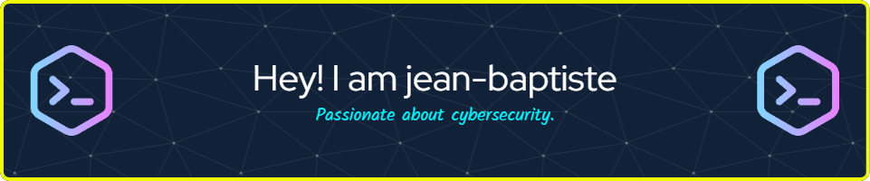

Bienvenue sur mon profil GitHub !
 
Je suis un développeur passionné, diplômé d'un Bac +2 en développement fullstack. Après une formation réussie à The Hacking Project et une formation de développeur WordPress chez OpenClassrooms, j'ai acquis une solide expertise en développement front-end, ainsi que des compétences en PHP, SCSS, JavaScript et l'intégration de maquettes Figma.
 
Mon parcours d'apprentissage en peer learning et mes projets collaboratifs m'ont permis de développer des compétences essentielles en travail d'équipe et en résolution de problèmes techniques.
 
Aujourd'hui, je suis animé par une nouvelle passion : la cybersécurité et l'administration des systèmes et réseaux. Convaincu que ma solide base en développement, associée à ma détermination à réussir dans ce nouveau domaine, fera de moi un atout précieux pour toute équipe. Je suis actuellement à la recherche d'une alternance en administration des systèmes et réseaux et en sécurité.
 
N'hésitez pas à explorer mes projets et à me contacter pour toute collaboration ou opportunité professionnelle.
 
 🔭 Je travaille actuellement sur cette page.
 
 🔭 Je travaille actuellement sur le projet Auto-Host DevOps, où je bâtis une infrastructure complète, de la conception initiale jusqu'à la création et le déploiement d'un site web, le tout avec une approche DevOps.
 
 🔭 Passionné par la cybersécurité, je m'exerce via TryHackMe, HTB Academy, PentesterLab, et PortSwigger.

  

<h3 align="left">Connect with me:</h3>

<h3 align="left">Languages and Tools:</h3>

                    

&nbsp;

